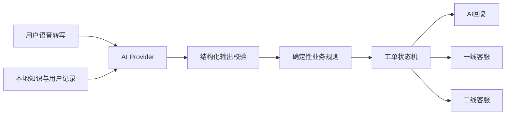

# Customer Service Copilot

一个可交互的客服AI工单演示项目：AI先识别用户诉求、查询可信依据并生成结构化工单，再依据风险和证据状态自动回复或转交人工客服。

项目重点展示AI如何参与现有客服工单流程，同时通过确定性业务规则限制AI权限。补发、退订、退款、举报登记等操作均由人工确认，AI不会直接执行真实业务写操作。

## 演示流程

### AI Only

用户咨询取消自动续订后会员为何仍然有效。AI结合会员规则与用户状态回复；只有用户明确确认“已解决”后，工单才自动完结。若用户只点击“未解决，转人工”，系统保留原分类并派给一线客服。

### Low-Risk AI Assist & Handoff

用户先咨询优惠券未到账，随后明确要求补发并投诉活动规则。系统重新识别为低风险其他类并派给一线客服；一线完成人工补发模拟和部门通知后才能归档。

### High-Risk AI Fast-Track

用户表示取消续订后仍被扣费，要求退款并举报。系统按最高风险直接转二线客服；AI只生成摘要、风险原因和核查建议，不承诺退款结果。

## 设计原则

- **风险优先：** 多个诉求同时出现时，按最高风险路径流转。
- **证据可追溯：** AI回复、分类和建议必须关联知识来源或用户数据来源。
- **人工掌握写权限：** 退订、补发、退款、封禁和部门通知不由AI自动执行。
- **明确确认后完结：** 低风险信息咨询只有在用户确认解决后才能自动关闭。
- **结构化输出：** AI候选结果经过JSON Schema和业务规则双重校验后才能写入工单。
- **测试职责分离：** 开发检查与独立QA分别执行。

## 技术架构



- Next.js 16、React、TypeScript、Tailwind CSS 4
- DeepSeek Responses API真实模式
- Mock AI稳定演示与自动化测试
- Gemini备用Provider
- AJV JSON Schema校验
- Vitest、Testing Library、Playwright

## 本地运行

需要Node.js和npm。

```bash
npm install
cp .env.example .env.local
npm run dev
```

打开 [http://localhost:3000](http://localhost:3000)。默认使用Mock模式，不访问外部AI服务。

### 启用DeepSeek

在未提交的 `.env.local` 中配置：

```dotenv
AI_MODE=deepseek
DEEPSEEK_API_KEY=your_api_key
DEEPSEEK_MODEL=deepseek-v4-flash
```

API Key只在服务端读取。不要把 `.env.local`、密钥或令牌提交到Git仓库。

## 自动化检查

```bash
npm test
npm run typecheck
npm run lint
npm run build
AI_MODE=mock npm run test:e2e
```

分类与流转测试会读取仓库内的32条验收案例，覆盖混合诉求、身份未验证、证据不足、来源冲突、低置信、人工接管及高风险转派。

## 项目边界

- 使用本地JSON模拟知识库、会员、订单、支付和工单数据。
- 不连接真实客服、支付、会员或外呼系统。
- 不保存访问者输入或工单历史，刷新页面后演示状态重置。
- 人工操作按钮只模拟处理结果并记录审计信息。
- 真实AI失败时会明确提示，不能静默使用Mock结果冒充真实AI。

## 进一步阅读

- [技术设计](./TECHNICAL_DESIGN.md)
- [32条分类与流转验收案例](./tests/fixtures/classification-routing-cases.csv)
