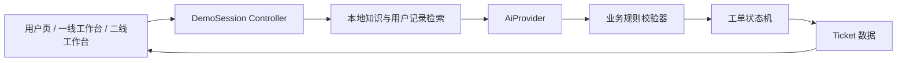

# 客服 Copilot MVP 技术设计

> 方案确认日期：2026-09-01  
> 当前阶段：三条Mock旅程与DeepSeek真实提供方均已实现并通过独立测试；Gemini作为备用实现保留

## 1. 目标与边界

本项目实现一个可本地运行、可稳定演示、可切换真实 DeepSeek 的客服 Copilot。它需要完整呈现三条用户旅程，并证明AI分类、依据追溯、人工接管、受控操作和工单闭环能够协同工作。Gemini实现暂时保留为备用，不作为默认真实AI路径。

MVP不接入生产工单、支付、会员或外呼系统；不引入数据库和向量数据库；退订、补发、退款、通知等写操作均为人工确认后的模拟结果。AI不得绕过业务规则或状态校验器直接改变工单。

## 2. 技术栈

| 层级 | 采用方案 | 用途 |
|---|---|---|
| 应用框架 | Next.js 16 App Router、React、TypeScript | 页面、服务端接口和类型安全 |
| 样式 | Tailwind CSS 4 | 快速实现原型界面与响应状态 |
| 包管理 | npm | 依赖与脚本管理 |
| 客户端状态 | React Context + `useReducer` | 管理演示会话、页面流转和人工操作 |
| 数据校验 | AJV | 校验工单数据和AI结构化输出 |
| AI接入 | 服务端原生 `fetch`；备用 `@google/genai` 2.20.0 | 调用DeepSeek Responses API；保留Gemini备用实现 |
| 单元/组件测试 | Vitest + Testing Library | 验证规则、状态变化和界面行为 |
| 端到端测试 | Playwright | 验证三条完整演示旅程 |

## 3. 总体结构



核心原则是把“AI提出的候选结果”和“系统允许生效的结果”分开：AI负责理解、生成和建议；校验器及状态机依据确定性规则决定分类、流转和操作是否可以生效。

## 4. AI提供方

应用只依赖统一接口，不让页面直接调用某一家模型：

```ts
interface AiProvider {
  analyze(input: AiAnalysisInput): Promise<AiAnalysisCandidate>;
}
```

### 4.1 `MockAiProvider`

- 不连接外部API，也不执行真正的模型检索。
- 接收已经由本地检索层找到的知识和用户记录，再按预设案例及规则返回确定结果。
- 用于稳定演示、自动化测试和没有网络或额度时的本地开发。
- Mock结果仍须经过与真实AI相同的Schema校验、业务校验和状态机。

### 4.2 `GeminiAiProvider`

- 通过服务端接口调用真实 Gemini Interactions API；浏览器端不得持有密钥。
- 使用环境变量 `GEMINI_API_KEY`，模型名使用 `GEMINI_MODEL` 配置，避免把尚未核实可用性的具体模型写死。
- 默认使用稳定模型 `gemini-3.7-flash`，并可通过 `GEMINI_MODEL` 覆盖；SDK固定为2.20.0，避免未来3.x升级直接改变运行环境和接口。
- Gemini结构化输出只生成候选字段和来源编号；Provider从可信输入重新装配完整来源对象，再由AJV做运行时校验。
- Gemini只接收完成当前工单所需的最小数据；不得上传无关用户信息。

### 4.3 `DeepSeekAiProvider`

- 通过服务端 `https://api.deepseek.com/responses` 调用DeepSeek官方Responses API；浏览器端不得持有密钥。
- 使用 `DEEPSEEK_API_KEY` 和 `DEEPSEEK_MODEL`，默认模型为 `deepseek-v4-flash`。
- 使用 `text.format.type=json_schema`约束候选字段；返回后仍经过完整本地AJV、来源白名单和业务规则校验。
- 请求超时为30秒，不上传无关用户信息，不把原始API错误或密钥返回给浏览器。

通过 `AI_MODE=mock|deepseek|gemini` 明确切换，默认稳定演示仍为Mock，当前首选真实AI为DeepSeek。首页真实AI初始化失败时会显示对应Provider原因并明确标注已降级为Mock；案例二追加诉求失败时停留在原状态，只有操作者点击“明确使用Mock继续”后才应用Mock结果，不能在不提示的情况下冒充真实AI结果。

## 5. 数据与检索

MVP使用仓库内的只读TypeScript/JSON演示数据：

- 知识库：规则正文、文档编号、章节、版本、可引用片段和标签。
- 用户记录：三个演示用户所需的会员、续订、订单、支付、发券等最小字段。
- 演示工单：以现有 `demo-tickets-v0.1.json` 为基线。

`AiAnalysisInput.user_facts`只包含回答当前问题所需的可信查询结果，例如会员状态、续订状态、权益到期时间或扣费记录。来源元数据与实际值分开传入；不加入用户活跃度、消费等级等画像。

检索层先按问题子类型、标签和关键词从本地数据中选择候选证据，再把同一份证据交给当前选择的AI Provider。这样可以保证不同AI模式的来源展示与业务边界一致。MVP数据量很小，无需向量数据库。

## 6. 数据模型分层

### 6.1 Ticket

`ticket-schema-v0.1.json` 是持久化工单的数据契约，保存当前有效业务状态、AI依据、流转结果和审计信息。原型未展示的字段仍须保存。

### 6.2 AiAnalysisCandidate

应用内新增一个小于完整Ticket的AI输出Schema，仅允许AI返回：

- 诉求摘要
- 候选分类、子类型、风险等级、理由和置信状态
- 建议回复和建议动作
- 使用的证据编号、信息缺口

AI Provider不直接输出完整Ticket，而只输出受限的候选Schema。DeepSeek使用Responses API的JSON Schema；Gemini提交时会移除其未声明支持的Schema约束。两者的返回结果都使用同一份完整本地AJV Schema严格校验，再进入业务规则校验器；AI不能填写工单编号、最终处理方、操作结果、完结方式等系统或人工字段。

### 6.3 DemoSession

`DemoSession` 是浏览器内的演示会话状态，不立即加入Ticket v0.1。它组合：

- 当前Ticket
- 对话消息
- 页面与交互事件
- 尚待人工确认的分类建议
- 当前演示视图

这样可以支持A1、A2、A3、B1、B2、C1之间的交互，又不会把“当前打开哪个页面”等临时界面信息污染正式工单契约。刷新或点击“重置演示”时从固定演示数据恢复；MVP不保证跨设备持久化。

## 7. 业务校验器与状态机

### 7.1 校验器

校验器对AI候选结果执行确定性检查，例如：

- 低置信、证据不足或冲突时禁止AI直接答复和自动完结。
- 出现退款、举报、账户安全、法律或安全诉求时强制进入高风险路径。
- 用户只点击“未解决”时保留原分类，不凭空增加补发或投诉。
- 用户明确追加“补发＋投诉”时才更新为低风险其他类。
- 活动争议案例中，AI只能建议人工审核补偿，不得把用户判断为符合原活动资格。

### 7.2 状态机

状态机只允许业务规则文档中定义的状态变化。每个界面按钮对应一个事件，例如：

- `USER_CONFIRMED_RESOLVED`
- `USER_REQUESTED_HUMAN`
- `USER_ADDED_REQUEST`
- `TIER1_CONFIRMED_RECLASSIFICATION`
- `TIER1_CONFIRMED_SIMULATED_REISSUE`
- `DEPARTMENT_NOTIFICATION_SENT`
- `TIER2_RECORDED_RESULT`

事件只有在前置条件满足时才能改变Ticket。例如案例二必须已有补偿审核结果、用户回复和成功的部门通知，才允许一线完结；案例三没有二线授权结果时不能写入退款成功。

## 8. 建议的应用目录

```text
src/
  app/
    page.tsx
    tier1/page.tsx
    tier2/page.tsx
    api/ai/analyze/route.ts
  components/
  domain/
    ticket/
    classification/
    workflow/
  ai/
    ai-provider.ts
    mock-ai-provider.ts
    deepseek-ai-provider.ts
    gemini-ai-provider.ts
  data/
    knowledge/
    users/
    demos/
  session/
  validation/
tests/
  unit/
  component/
  e2e/
```

具体拆分可在搭建时微调，但业务规则、AI提供方、检索、状态机和界面不得混写在单一页面组件中。

## 9. 测试策略

1. 用32条分类与流转测试集驱动规则测试，重点覆盖多类型取最高风险、低置信、证据不足和身份未验证。
2. 对状态机逐项验证允许与拒绝的变化，特别覆盖T031“只点未解决不改分类”和T032“新增诉求后由客服确认重新分类”。
3. 用Testing Library验证字段可见性和按钮守卫，例如没有 `reissue` 时不显示模拟补发，没有 `complaint` 时不显示部门通知。
4. 用Playwright验证三条演示旅程及A3到B1/B2的流转。
5. 默认自动化测试使用Mock，保证结果可重复；DeepSeek和Gemini只做可选的结构化输出契约冒烟测试，不把外部服务稳定性混入默认测试。
6. 每完成一个可运行功能或完整旅程，由独立 `qa_tester` 按验收标准测试；测试agent只报告问题，由实现者修复后再复测。

## 10. 安全、审计与失败处理

- DeepSeek及Gemini密钥只放在本机或部署环境变量中，不写入代码、文档、日志或客户端包。
- `/api/ai/analyze` 当前只接受固定的案例二追加诉求ID，不接受浏览器提交任意用户事实；这既满足演示动态分析，也缩小了MVP接口的数据和额度滥用面。
- API路由只返回界面所需内容，日志对用户标识和业务记录做最小化处理。
- 保存 `prompt_version`、知识库版本、来源编号、AI模式和人工修改记录，便于复现结果。
- AI输出Schema不合法、引用不存在或违反业务规则时拒绝应用结果，并记录可诊断错误。
- 真实AI与Mock模式在界面上明确标识，避免演示结果来源混淆。

## 11. 实施顺序

1. 初始化Next.js工程、测试工具和基础目录。
2. 实现Ticket类型、AI候选Schema、AJV校验器、业务规则和状态机。
3. 实现本地知识/用户数据、`MockAiProvider`及三条稳定演示数据。
4. 实现用户页、一线工作台和二线工作台，完成Mock模式端到端流程。
5. 接入 `DeepSeekAiProvider`，配置 `DEEPSEEK_MODEL` 并完成四个真实输入的结构化输出冒烟测试。（已完成）
6. 保留 `GeminiAiProvider` 作为备用；不再阻塞DeepSeek主路径。
7. 完成开发检查，委派独立测试agent测试并按结果修复、复测。（已完成）

## 12. 部署决策

- 作品集演示版使用Vercel托管，通过GitHub仓库连接和更新。
- DeepSeek密钥只配置为Vercel服务端环境变量，不进入仓库或客户端包。
- MVP继续使用浏览器内演示会话，不增加数据库；刷新页面后恢复固定案例。
- 公开访问前需要确定真实AI的调用额度和滥用控制方式。

## 13. 官方技术依据

- [Gemini API JavaScript快速开始](https://ai.google.dev/gemini-api/docs/get-started)
- [Gemini Interactions API](https://ai.google.dev/gemini-api/docs/interactions-overview)
- [Gemini结构化输出](https://ai.google.dev/gemini-api/docs/structured-output)
- [Gemini API密钥安全与迁移说明](https://ai.google.dev/gemini-api/docs/api-key)
- [DeepSeek API快速开始](https://api-docs.deepseek.com/)
- [DeepSeek Responses API](https://api-docs.deepseek.com/api/create-response/)
- [DeepSeek模型与价格](https://api-docs.deepseek.com/quick_start/pricing)
